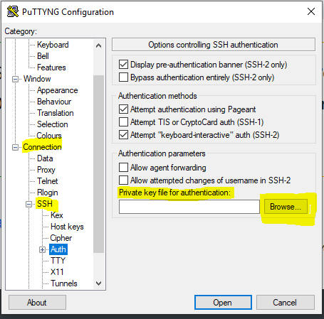
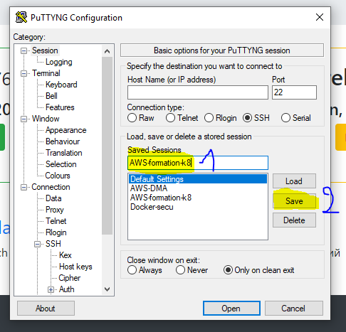
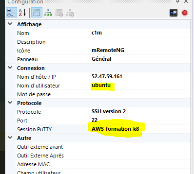

# install K8s on AWS IaaS with kubeadm

## se connecter en ssh sur chaque vm (master, worker 1 et worker 2)

### sous linux

cloner le repo "k8s" à la racine de votre répertoire home ~

```
cp ~/k8s/02-Install/install-iaas-aws/key/formation-k8-key.pem ~
chmod 600 ~/formation-k8-key.pem
ssh -i ~/formation-k8-key.pem ubuntu@<IP>
```


### sous windows

client ssh https://mremoteng.org/download (choisir le zip)

https://mremoteng.org/download

Lancer Puttyng qui se trouve dans le répertoire téléchargée


séléctionner le fichier ./key/formation-k8-key.ppk
sauvegarder la configuration putty


config mRemoteNG


## git clone sur les 3 VM

```
cd ~
git clone https://gitlab.groupeonepoint.com/onepoint-academy/k8s.git
```


## install pre requis SUR LES 3 VM (en //)

```sh

# !!!!!!!! change dir !!!!!!!!!!
cd ~/k8s/02-Install/install-iaas-aws/provision/

# make script executable
chmod a+x *.sh

# check script
more setup.sh

# run script 
./setup.sh

# test Docker (provoque une erreur "normal" car l'ajout du user ubuntu dans le group docker n'est pas prise en compte en live)
docker info

# se déconnecter et reconnecter
docker info
kubeadm version


```


## init du cluster sur le master

Connect with ssh on the **master**


```sh
# URL spécifique AWS pour récupérer l'IP public d'une VM AWS
export PUBLIC_IP=$(curl http://169.254.169.254/latest/meta-data/public-ipv4)

echo $PUBLIC_IP

# pre-pull images
sudo kubeadm config images pull

# init the cluster
sudo kubeadm init --apiserver-bind-port 443 --apiserver-cert-extra-sans=$PUBLIC_IP --pod-network-cidr=10.244.0.0/16
```

# ATTENTION !!!!!!!!!!!!!!!!!!!!!!!!!!!!!!!!!!!!!!!!!!!!!!!!!!!!!!!!!!!!!!!!!!!!!!!!!!!!!!!!!!!!!!!!!!!!!!!!!!
/!\ Copy paste the printed instruction after  : Your Kubernetes control-plane has initialized successfully!


complete the config

```sh
mkdir -p $HOME/.kube
sudo cp -i /etc/kubernetes/admin.conf $HOME/.kube/config
sudo chown $(id -u):$(id -g) $HOME/.kube/config

# auto completion and alias
echo "source <(kubectl completion bash)" >> ~/.bashrc
echo "alias k=kubectl" >> ~/.bashrc
echo "complete -F __start_kubectl k" >> ~/.bashrc
source ~/.bashrc

# check kubernetes item (coredns pod pending)
kubectl get all --all-namespaces

# install CANAL pod network"
kubectl apply -f https://docs.projectcalico.org/v3.8/getting-started/kubernetes/installation/hosted/canal/canal.yaml


# re check kubernetes item (wait for canal and coredns running)
kubectl get pod --namespace kube-system
```

Pour retrouver les paramètres la commande kubeadm join (si vous les avez perdus...)

```
# prepare add node https://kubernetes.io/fr/docs/setup/independent/create-cluster-kubeadm/#join-nodes
echo "kubeadm token list :"
kubeadm token list

 # discovery-token-ca-cert-hash
echo "discovery-token-ca-cert-hash :"

openssl x509 -pubkey -in /etc/kubernetes/pki/ca.crt | openssl rsa -pubin -outform der 2>/dev/null | \
   openssl dgst -sha256 -hex | sed 's/^.* //'
```
## pour interagir avec le cluster depuis votre PC

### install kubectl

https://kubernetes.io/fr/docs/tasks/tools/install-kubectl/

#### sous linux sans droit admin

```sh
mkdir ~/bin
cd ~/bin
curl -LO https://storage.googleapis.com/kubernetes-release/release/v1.14.6/bin/linux/amd64/kubectl
chmod +x ./kubectl
echo "export PATH=$PATH:~/bin" >> ~/.bashrc
source ~/.bashrc
```

### config

- copier le contenu du fichier ~/.kube/config (avec la commande ```cat``` et non ```more``` car ajouter des sauts de lignes) dans un fichier sur votre pc (par exemple my-config.conf).
- **REMPLACER** l'IP (privée) par l'IP public de votre master
- lancer un shell
- se positionner dans le répertoire du fichier
- initialiser une variable d'environnement qui pointe sur le fichier exemple sous windows ```set KUBECONFIG=%cd%\my-config.conf```
- kubectl get nodes

## init des workers (sur les 2 VMs)

Utiliser la commande kubeadm join affichée lors de l'init en ajoutant **sudo** devant sinon

error execution phase preflight: [preflight] Some fatal errors occurred:
        [ERROR IsPrivilegedUser]: user is not running as root


```sh
sudo kubeadm join <control-plane-host>:<control-plane-port> --token <token> --discovery-token-ca-cert-hash sha256:<hash>
```

- control-plane-host : IP Privée du master
- control-plane-port : 443
- token : ```kubeadm token list```
- hash : ```openssl x509 -pubkey -in /etc/kubernetes/pki/ca.crt | openssl rsa -pubin -outform der 2>/dev/null | \
   openssl dgst -sha256 -hex | sed 's/^.* //'```