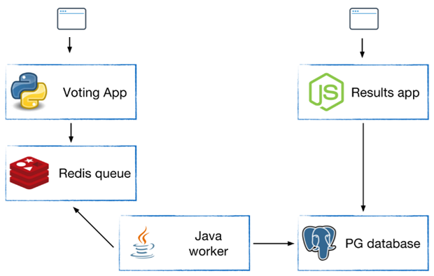

# Voting APP




Les yaml correspondant au Deployment de chaque brique sont fournis

- creer le namespace vote 
- mettre le namespace vote comme namespace "current"
- déployer tous les yaml avec une seule commande ```kubectl apply -f .```
- tester l'application (tips : retrouver les ports utilisés par les containers dans les yaml & retrouver les ip des pods avec l'option ```kubectl get pod -o wide``` )

que manque-t-il pour que l'application fonctionne ?

L'application est codée avec les pieds ;-) les développeurs ont codé en dur le nom de l'hôte du redis et de la base PG :
```java
      Jedis redis = connectToRedis("redis");
      Connection dbConn = connectToDB("db");
```

Que faire :
1. je demande au DEV de refaire une image en replacement le nom en dur par l'IP des pod redis et db
2. je demande au DEV de refaire une image en variabilisation le hostname de la base et du redis
3. je trouve une autre solution


Votre mission : Faire fonctionner l'application en ajoutant les services qui vont bien.
TIPS regarder les labels des resources via une commande ```kubectl get all --show-labels```